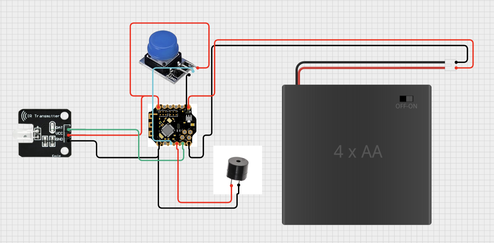
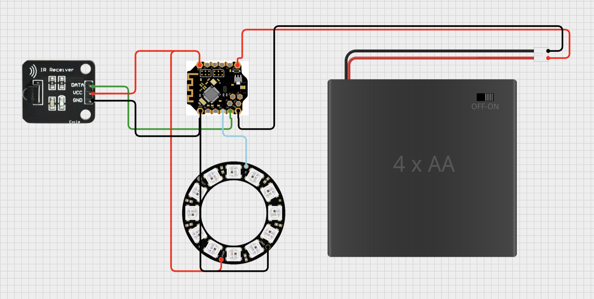
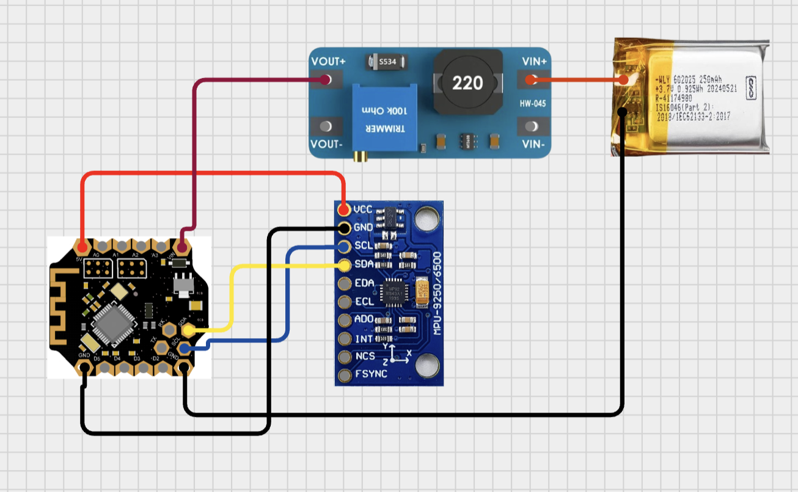

# Hardware Components for Laser Tag System

The project aims to develop a wearable system for detection player movement and laser gun shooting. Each player is equipped with a laser gun, a vest, and a pair of gloves. 
## Table of Contents

- [Laser Gun](#laser_gun)
- [Vest](#vest)
- [Glove](#glove)

## Laser_Gun

- Bluno Beetle * 1
- IR Transmitter Module * 1
- Buzzer * 1
- Push Button * 1
- 4 AA Battery Holder * 1

### Laser Gun Circuit

## Vest

- Bluno Beetle * 1
- IR Receiver Module * 1
- LED Ring * 1
- 4 AA Battery Holder * 1

### Vest Circuit

## Glove

- Bluno Beetle * 1
- MPU6050 * 1
- Lipo Battery * 1
- Boost Converter * 1

### Glove Circuit
